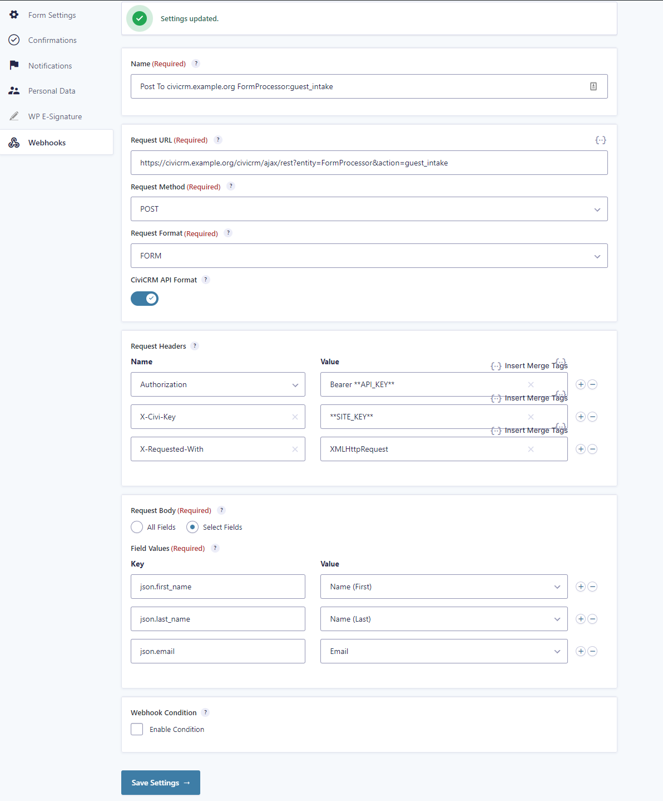
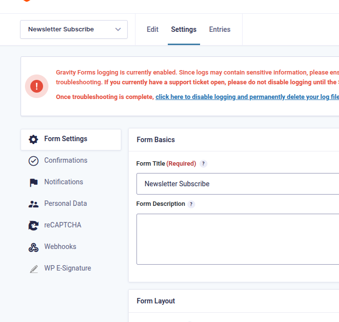
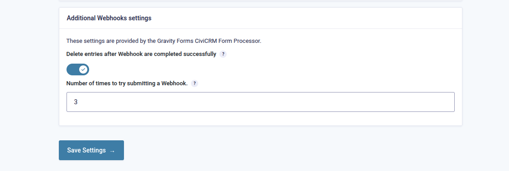

# Gravity Forms CiviCRM Form Processor

Send remote requests to [CiviCRM](https://civicrm.org/) with [Gravity Forms](https://www.gravityforms.com/) [Webhooks](https://www.gravityforms.com/add-ons/webhooks/). This can be done directly to the [CiviCRM API](https://docs.civicrm.org/dev/en/latest/api/) or via [Form Processor](https://lab.civicrm.org/extensions/form-processor).

## What does this extension do?

TL;DR; This extension makes it easier to send data from a Gravity Form to a remote CiviCRM installation.

The CiviCRM REST REST API consumed data via encoded JSON a HTTP form post. In [APIv3](https://docs.civicrm.org/dev/en/latest/api/v3/rest/), this variable is `json`, in [APIv4](https://docs.civicrm.org/dev/en/latest/api/v4/rest/) this variable is `params`. Out of the box, the Gravity Forms Webhooks extension does not support structured JSON or combining data encodings like this (i.e. a Request Format of FORM containing encoded JSON).

This extension also add the option to send an email notification when a webhook to CiviCRM fails.

## How do I get this up and running?

1. (Recommended) Install and configure the [AuthX](https://docs.civicrm.org/dev/en/latest/framework/authx/) extension that comes with CiviCRM. This gives many options for authentication mechanisms.
   1. Configure authentication rules and mechanisms (Administer -> Administration Console -> Authentication). The defaults are probably okay.
2. (Recommended) Install [API Key](https://civicrm.org/extensions/api-key) Extension
3. (Recommended) Install the [Action Provider](https://civicrm.org/extensions/action-provider) and [Form Processor](https://civicrm.org/extensions/form-processor) extensions. These are not necessary, but they do provide quite a bit for flexibility in how data from Gravity Forms is processed compared to directly using the CiviCRM API.
4. Create a new contact to function as the creator of any data coming in from Gravity Forms; there are a [number of ways to authenticate](https://docs.civicrm.org/dev/en/latest/framework/authx/#flows) with this contact. This contact might need an attached user account if the Gravity Forms requests will require specific permissions.
   1. Add an API Key to this contact.
   2. Not the API Key and Site Key (if using Site Key Guard in AuthX)
5. Determine the CiviCRM API end point. There are a number of options: legacy, modern, CMS specific... In this example, we will use the modern ones.
   1. Wordpress
      1. https://civicrm.example.org/civicrm/ajax/rest
      2. https://civicrm.example.org/wp-json/civicrm/v3/rest
      3. https://civicrm.example.org/civicrm/?civiwp=CiviCRM&q=civicrm/ajax/rest
   2. Drupal
      1. https://civicrm.example.org/civicrm/ajax/rest
   3. Joomla
      1. https://civicrm.example.org/index.php?option=com_civicrm&format=raw&task=civicrm/ajax/rest
      2. (with customization) https://civicrm.example.org/civicrm/ajax/rest
         1. To use the clean version of the URL with Joomla, add these likes to the `.htaccess` file user the `` section
         ```
         # Provide a consistant way to access civicrm content
         RewriteCond %{REQUEST_URI} ^/civicrm/(.*)$
         RewriteRule ^(.*)$ index.php?option=com_civicrm&format=raw&task=$1 [QSA]
         ```
6. Create a Gravity Form
7. Go to the Form Settings and add a Webhook
   1. Add the CiviCRM API end point to the Request URL with `entity` (e.g. Contact) and `action` (e.g. create) as query string parameters.
   2. Choose `POST` for the Request Method and `FORM` for the Request Format. 
   3. Enable the CiviCRM API Format
   4. Add Request Headers to provide authentication with CiviCRM. Out of the box, three are necessary with AuthX.
      1. `Authorization: Bearer **API_KEY**`
      2. `X-Civi-Key: **SITE_KEY**`
      3. `X-Requested-With: XMLHttpRequest`
   5. Under the Request Body choose to Select Fields.
      1. Any normal key field will be directly passed to CiviCRM
      2. Any key that needs pass to CiviCRM in the `json` (v3) or `params` (v4) JSON encoded form value, prepend `json.` or `params.` respectively. For example, to send CiviCRM a first name in the request, create the key `json.first_name`.



### Other settings

Two additional helper settings are added to the form settings.



 - **Delete entries after Webhook are completed successfully**: Enabling this setting will delete entries after all Webhooks successfully resolve. Useful for data security.
 - **Number of times to try submitting a Webhook**: By default, Gravity Forms will only attempt to submit a Webhooks one time. This setting will allow a Webhook to be tried multiple times.

